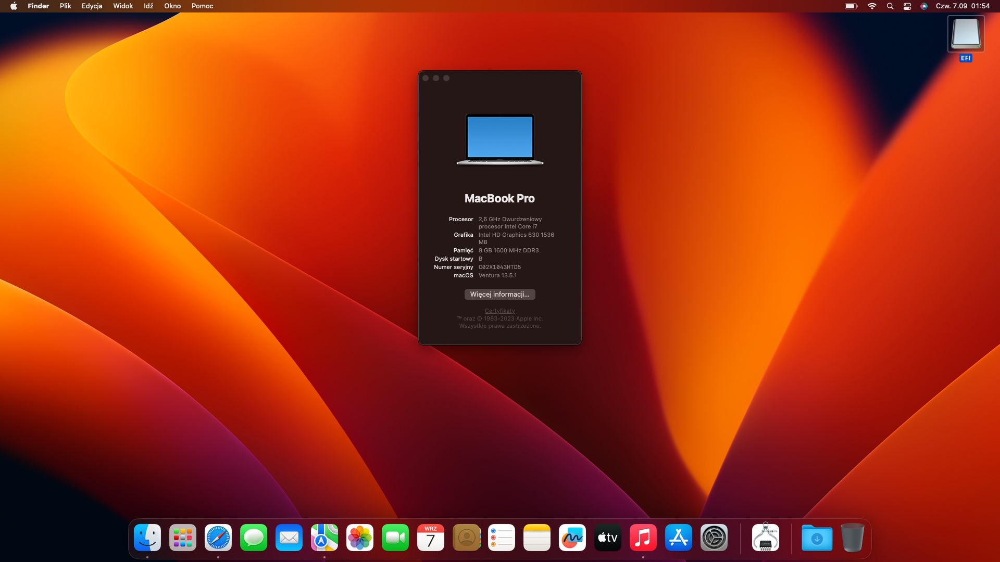

# ASUS-UX303U-OpenCore

<b>Ready-to-use OpenCore 0.8.7 EFI for ASUS-UX303U-OpenCore -  1:1 copy of Lenovo Legion Y520-15IKBN</b>

UX303U config:

CPU : i7-6500U
GPU : intel 520  + Nvidia GT940
SSD : Samsung 950 PRO
RAM:  8GB
WIFI: Intel 

## 🔘 Status
| Feature | Works? | Notes |
| :---: | :---: | :---: |
| **Built-in Wi-Fi ** | ✅ | Works also in macOS Recovery |
| **Ethernet** | ✅ | - |
| **Intel GPU (iGPU)** | ✅ | - |
| **Audio** | ✅ | - |
| **Microphone** | ✅ | - |
| **Webcam** | ✅ | - |
| **External display via HDMI** | ✅ | - |
| **Build-in keyboard** | ✅ | - |
| **Trackpad** | ✅ | - |
| **USB 2, USB 3 & USB-C** | ✅ | - |
| **Sleep** | ✅ | - |
| **Battery percentage** | ✅ | - |
| **Nvidia GPU** | ❌ | - |
| **Blutetooth** | ❌ | - |
| **SD Card Reader** | ✅ | - |

## 🔧 BIOS Settings
| Setting | Enabled? |
| :---: | :---: |
| Secure Boot | ❌ |
| Fast Boot | ❌ |
| DVMT Pre-Allocated 64M | ✅ |
| Intel Virtual Technology | ✅ |
| Intel Platform Trust Technology | ❌ |

